<p align="center">
  
</p>

<h1 align="center">Anilix</h1>

<p align="center">
  A cyberpunk-themed terminal anime streaming client written in Go.<br/>
  Search anime, browse episodes, and stream directly from your terminal.<br/>
</p>
  
<h2 align="center">Demonstrate</h2>

[Anilix-Demo.mp4](https://gist.github.com/user-attachments/assets/c9fdce3f-dd7c-4a06-a6a1-821ac9bdcf2f.mp4)
---

<p align="center">
  <a href="#features">Features</a> &bull;
  <a href="#supported-platforms">Platforms</a> &bull;
  <a href="#keybindings">Keybindings</a> &bull;
  <a href="#installation">Installation</a> &bull;
  <a href="#usage">Usage</a> &bull;
  <a href="#configuration">Configuration</a> &bull;
  <a href="#tech-stack">Tech Stack</a>
</p>

---

<h2 align="center" id="features">Features</h2>

<div align="center">

| | |
|:---:|:---:|
| **Interactive TUI** — Two-column search layout with instant metadata preview and detail view with episode browser, built on Bubble Tea v2 | **Smart Search** — Fast anime search with automatic metadata fetching and fallback sources |
| **Batch Metadata** — Fetches all search result metadata in a single call for instant j/k navigation without per-item requests | **Quality Selection** — Cycle through presets: best → 1080p → 720p → 480p → 360p → auto, via settings popup |
| **Sub/Dub Toggle** — Switch between subtitled and dubbed versions with `Ctrl+T` | **Auto-Skip Intro/Outro** — Automatically skips intros and outros with mpv Lua script for seamless seeking |
| **Recent Searches** — Persists your last 10 searches for quick access | **Multi-host Extraction** — Extracts direct streams from multiple hosts with automatic fallback |
| **Android Proxy** — Local HTTP proxy bridges Android apps and PRoot/Termux for seamless stream playback on mobile | **Persistent Caching** — SQLite-backed ID mapping for fast repeated lookups |

</div>

---

<h2 align="center" id="supported-platforms">Supported Platforms</h2>

<div align="center">

<table>
  <tr>
    <th>Platform</th>
    <th>Supported Players</th>
  </tr>
  <tr>
    <td align="center">Linux</td>
    <td align="center">mpv, vlc</td>
  </tr>
  <tr>
    <td align="center">macOS</td>
    <td align="center">mpv, vlc, iina</td>
  </tr>
  <tr>
    <td align="center">Windows</td>
    <td align="center">mpv, vlc</td>
  </tr>
  <tr>
    <td align="center">Android (Termux)</td>
    <td align="center">mpv-android, vlc-android</td>
  </tr>
</table>

</div>

---

<h2 align="center" id="keybindings">Keybindings</h2>

<div align="center">

<table>
  <tr>
    <th>Key</th>
    <th>Action</th>
  </tr>
  <tr>
    <td align="center"><code>j</code> / <code>k</code> / <code>&uarr;</code> / <code>&darr;</code></td>
    <td align="center">Navigate lists</td>
  </tr>
  <tr>
    <td align="center"><code>Enter</code></td>
    <td align="center">Search / Select / Confirm</td>
  </tr>
  <tr>
    <td align="center"><code>Esc</code></td>
    <td align="center">Back / Cancel</td>
  </tr>
  <tr>
    <td align="center"><code>/</code></td>
    <td align="center">Focus search bar</td>
  </tr>
  <tr>
    <td align="center"><code>Ctrl+T</code></td>
    <td align="center">Toggle sub/dub</td>
  </tr>
  <tr>
    <td align="center"><code>Ctrl+S</code></td>
    <td align="center">Open settings popup</td>
  </tr>
  <tr>
    <td align="center"><code>Ctrl+C</code></td>
    <td align="center">Quit</td>
  </tr>
</table>

</div>

---

<h2 align="center" id="installation">Installation</h2>

<h3 align="center">Quick Install (Recommended)</h3>

<p align="center"><b>Linux / macOS / Termux:</b></p>

<div align="center">

```sh
curl -fsSL https://raw.githubusercontent.com/hishantik/anilix/main/install.sh | sh
```

</div>

<p align="center"><b>Windows (PowerShell):</b></p>

<div align="center">

```powershell
Invoke-WebRequest -Uri "https://raw.githubusercontent.com/hishantik/anilix/main/install.bat" -OutFile "install.bat"; .\install.bat
```

</div>

<h3 align="center">Go Install</h3>

<div align="center">

```sh
go install github.com/hishantik/anilix@latest
```

</div>

<h3 align="center">Build from Source</h3>

<div align="center">

```sh
git clone https://github.com/hishantik/anilix.git && cd anilix && go build -o anilix .
```

</div>

<p align="center">
  <b>Note:</b> On PRoot environments (e.g., Termux), build from <code>/tmp</code> to avoid filesystem locking errors:
</p>

<div align="center">

```sh
mkdir -p /tmp/anilix-build && cp -r . /tmp/anilix-build/ && cd /tmp/anilix-build && go build -o ~/anilix .
```

</div>

<h3 align="center">Manual Download</h3>

<p align="center">
  Download the latest binary for your platform from <a href="https://github.com/hishantik/anilix/releases">GitHub Releases</a>.
</p>

---

<h2 align="center" id="usage">Usage</h2>

<p align="center">Launch the interactive TUI:</p>

<div align="center">

```sh
anilix
```

</div>

<p align="center">Or explicitly:</p>

<div align="center">

```sh
anilix tui
```

</div>

<p align="center">Other commands:</p>

<div align="center">

```sh
anilix version
```

</div>

---

<h2 align="center" id="configuration">Configuration</h2>

<p align="center">
  Configuration is stored at <code>~/.anilix/anilix.toml</code>.<br/>
  Settings can also be changed at runtime via the <code>Ctrl+S</code> popup menu.
</p>

<div align="center">

<table>
  <tr>
    <th>Key</th>
    <th>Default</th>
    <th>Description</th>
  </tr>
  <tr>
    <td align="center"><code>player</code></td>
    <td align="center"><code>mpv</code></td>
    <td align="center">Media player to use for playback</td>
  </tr>
  <tr>
    <td align="center"><code>quality</code></td>
    <td align="center"><code>auto</code></td>
    <td align="center">Stream quality preset (<code>best</code>, <code>1080p</code>, <code>720p</code>, <code>480p</code>, <code>360p</code>, <code>auto</code>)</td>
  </tr>
  <tr>
    <td align="center"><code>source</code></td>
    <td align="center"><em>(empty)</em></td>
    <td align="center">Preferred stream source</td>
  </tr>
  <tr>
    <td align="center"><code>history.enabled</code></td>
    <td align="center"><code>true</code></td>
    <td align="center">Enable watch history</td>
  </tr>
  <tr>
    <td align="center"><code>aniskip.enabled</code></td>
    <td align="center"><code>true</code></td>
    <td align="center">Auto-skip intros/outros</td>
  </tr>
</table>

</div>

---

<h2 align="center" id="tech-stack">Tech Stack</h2>

<div align="center">

<table>
  <tr>
    <td align="center"><b>Go</b><br/><a href="https://github.com/spf13/cobra">Cobra</a> for CLI structure</td>
    <td align="center"><b>Bubble Tea v2</b><br/><a href="https://github.com/charmbracelet/bubbletea">Bubble Tea</a> + <a href="https://github.com/charmbracelet/bubbles">Bubbles</a> + <a href="https://github.com/charmbracelet/lipgloss">Lip Gloss</a></td>
  </tr>
  <tr>
    <td align="center"><b>Viper</b><br/><a href="https://github.com/spf13/viper">Configuration management</a></td>
    <td align="center"><b>GoReleaser</b><br/><a href="https://github.com/goreleaser/goreleaser">Cross-platform builds</a></td>
  </tr>
  <tr>
    <td align="center"><b>SQLite</b><br/>Local persistent caching</td>
    <td align="center"><b>mpv Lua Scripts</b><br/>Intro/outro skip integration</td>
  </tr>
</table>

</div>

---

<h2 align="center" id="license">License</h2>

<p align="center">This project is licensed under the <a href="./LICENSE">MIT License</a>.</p>

---

<p align="center">Inspired by <a href="https://github.com/pystardust/ani-cli">ani-cli</a>.</p>
